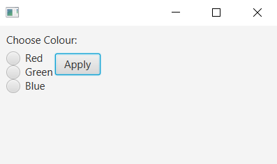
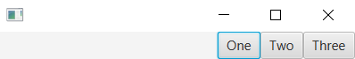
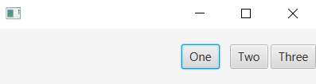
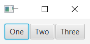

# FXML Code
```xml
<AnchorPane id="AnchorPane" prefHeight="200" prefWidth="400"
            xmlns:fx="http://javafx.com/fxml/1">
            
    <fx:define>
        <ToggleGroup fx:id="grpColours" />
    </fx:define>
    <children>
        <Label layoutX="10" layoutY="10" text="Choose Colour:" />
        <Button layoutX="80" layoutY="40" text="_Apply" mnemonicParsing="true" /> 
        <RadioButton text="_Red" mnemonicParsing="true" toggleGroup="$grpColours"
            layoutX="10" layoutY="36" />
        <RadioButton text="_Green" mnemonicParsing="true" toggleGroup="$grpColours"
            layoutX="10" layoutY="56" />
        <RadioButton text="_Blue" mnemonicParsing="true" toggleGroup="$grpColours"
            layoutX="10" layoutY="76" />
    </children>
</AnchorPane>
```


# Alignment and Positioning
> Pos: used for both horizontal and vertical positioning and alignment.
> VPos: used for vertical positioning and alignment.
> HPos: used for horizontal positioning and alignment.
```xml
<FlowPane alignment="BOTTOM_RIGHT">
    <children>
        <Button text="One" />
        <Button text="Two" />
        <Button text="Three" />
    </children>
</FlowPane>
```


# Margins
```xml
<FlowPane vgap="5" hgap="3" alignment="BOTTOM_RIGHT">
    <children>
        <Button text="One">
            <FlowPane.margin>
                <Insets top="20" bottom="20" left="10" right="10" />
            </FlowPane.margin>
        </Button>
        <Button text="Two" />
        <Button text="Three" />
    </children>
</FlowPane>
```


# Padding
```xml
<HBox spacing="2" >
    <padding>
        <Insets top="10" bottom="10" left="10" right="10" />
    </padding>
    <children>
        <Button text="One" />
        <Button text="Two" />
        <Button text="Three" />
    </children>
</HBox>
```

