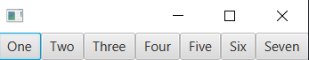
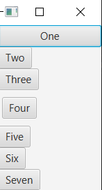

# FlowPane
> - alignment: sets the default alignment of nodes inside the pane.
> - hgap: sets the horizontal gap to use in the pane
> - vgap: sets the vertical gap to use in the pane
> - FlowPane.margin: sets the margin around a node with an Insets object
> - padding: sets the amount of padding between nodes and the pane's inner borders

# VBox and HBox Layout
> - alignment: sets the default alignment of nodes inside the pane.
> - spacing: sets the horizontal gap to use in the pane
> - HBox.margin/VBox.margin: sets the margin around a node with an Insets object
> - padding: sets the amount of padding between nodes and the pane's inner borders
```xml
<HBox fillHeight="false"
    xmlns:fx="http://javafx.com/fxml/1" >
    <Button text="One">
        <maxHeight>
            <Double fx:constant="MAX_VALUE" />
        </maxHeight>
    </Button>
    <Button text="Two" />
    <Button text="Three" />
    <Button text="Four" />
    <Button text="Five" />
    <Button text="Six" />
    <Button text="Seven" />
</HBox>
```


```xml
<VBox fillWidth="true"
    xmlns:fx="http://javafx.com/fxml/1">
    <Button text="One">
        <maxWidth>
            <Double fx:constant="MAX_VALUE" />
        </maxWidth>
    </Button>
    <Button text="Two" />
    <Button text="Three" />
    <Button text="Four">
        <VBox.margin>
            <Insets top="10" bottom="10" right="5" left="5" />
        </VBox.margin>
    </Button>
    <Button text="Five" />
    <Button text="Six" />
    <Button text="Seven" />
</VBox>
```
