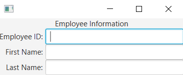
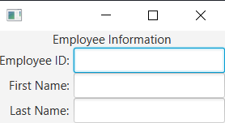
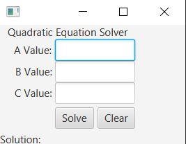

# GridPane
> - alignment: sets the alignment of the grid within its height and width (if there is space for it to align).
> - GridPane.halignment, GridPane.valignment: sets the horizontal/vertical alignment for an individual node
> - hgap: sets the horizontal gap between columns in the grid
> - vgap: sets the vertical gap between rows in the grid
> - GridPane.margin: sets the margin around a node with an Insets object
> - padding: sets the amount of padding between nodes and the pane's inner borders

> - GridPane.rowIndex="#"
>   - The row # in which to place the control.
> - GridPane.columnIndex="#"	
>   - The column # in which to place the control.
> GridPane.rowSpan="#"	
>   - The number of rows this node should span. The node won't necessarily resize unless you make it resizable. You can use alignment properties to define how the node should be aligned within the spanned rows if the node is not taking up the entire cell area.
> - GridPane.columnSpan="#"	
>   - The number of columns this node should span. The node won't necessarily resize unless you make it resizable. You can use alignment properties to define how the node should be aligned within the spanned columns if the node is not taking up the entire cell area.
> - GridPane.halignment="HPOS"	
>   - How the node should be horizontally aligned inside the cell. The value should be one of the HPOS enum constants.
> - GridPane.valignment="VPOS"	
>   - How the node should be vertically aligned inside the cell. The value should be one of the VPOS enum constants.

# ColumnConstraints
```xml
<GridPane xmlns:fx="http://javafx.com/fxml/1" >
    <columnConstraints>
        <ColumnConstraints percentWidth="25.0" />
        <ColumnConstraints percentWidth="75.0" />
<!--        <ColumnConstraints hgrow="NEVER" />
        <ColumnConstraints hgrow="ALWAYS" />-->
    </columnConstraints>
    <children>
        <Label text="Employee Information" GridPane.rowIndex="0" GridPane.columnSpan="2"
             GridPane.halignment="CENTER" />
        <Label text="Employee ID:" GridPane.columnIndex="0" GridPane.rowIndex="1"
            GridPane.halignment="RIGHT">
            <GridPane.margin>
                <Insets right="5.0" />
            </GridPane.margin>
        </Label>
        <TextField fx:id="txtId" GridPane.columnIndex="1" GridPane.rowIndex="1" />
        <Label text="First Name:" GridPane.columnIndex="0" GridPane.rowIndex="2"
            GridPane.halignment="RIGHT">
            <GridPane.margin>
                <Insets right="5.0" />
            </GridPane.margin>
        </Label>
        <TextField fx:id="txtFName" GridPane.columnIndex="1" GridPane.rowIndex="2" />
        <Label text="Last Name:" GridPane.columnIndex="0" GridPane.rowIndex="3"
            GridPane.halignment="RIGHT">
            <GridPane.margin>
                <Insets right="5.0" />
            </GridPane.margin>
        </Label>
        <TextField fx:id="txtLName" GridPane.columnIndex="1" GridPane.rowIndex="3" />
    </children>
</GridPane>
```


> - ALWAYS 
>   - the node will try to grow/shrink whenever it can. If more than one node is set to ALWAYS, they will share the space.
> - SOMETIMES
>   - the node will grow or shrink but only if no other node is set to ALWAYS. If there are other nodes set to SOMETIMES, all of the SOMETIMES nodes will share the space.
> - NEVER
>   - the node will never grow or shrink, even when there is space available.

```xml
<columnConstraints>
        <ColumnConstraints hgrow="NEVER" />
        <ColumnConstraints hgrow="ALWAYS" />
    </columnConstraints>
```


# Exercise 
```xml
<GridPane>
    <Label text="Quadratic Equation Solver" GridPane.halignment="CENTER"  GridPane.rowIndex="0" GridPane.columnIndex="0" GridPane.columnSpan="3"/>
    <Label text="A Value: " GridPane.halignment="RIGHT" GridPane.rowIndex="1" GridPane.columnIndex="0">
        <GridPane.margin>
            <Insets left="20"/>
        </GridPane.margin>
    </Label>
    <TextField GridPane.rowIndex="1" GridPane.columnIndex="1" GridPane.columnSpan="2" prefWidth="150.0"/>
    <Label text="B Value: " GridPane.halignment="RIGHT" GridPane.rowIndex="2" GridPane.columnIndex="0"/>
    <TextField GridPane.rowIndex="2" GridPane.columnIndex="1" GridPane.columnSpan="2"/>
    <Label text="C Value: " GridPane.halignment="RIGHT" GridPane.rowIndex="3" GridPane.columnIndex="0"/>
    <TextField GridPane.rowIndex="3" GridPane.columnIndex="1" GridPane.columnSpan="2"/>
    <Button text="Solve" GridPane.rowIndex="4" GridPane.columnIndex="1" >
        <GridPane.margin>
            <Insets top="5" bottom="5" right="5"/>
        </GridPane.margin>
    </Button>
    <Button text="Clear" GridPane.rowIndex="4" GridPane.columnIndex="2" />
    <Label text="Solution:" GridPane.rowIndex="5" GridPane.columnIndex="0" GridPane.columnSpan="3"/>
</GridPane>
```
