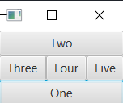

# Border Pane

> - BorderPane.alignment: sets the alignment of a specific node inside its area.
> - BorderPane.margin: sets the margin around a node with an Insets object
> - padding: sets the amount of padding between nodes and the pane's inner borders

```xml
<BorderPane xmlns:fx="http://javafx.com/fxml/1" >
    <bottom>        
        <Button text="One" maxWidth="Infinity" />
    </bottom>
    <top>
        <Button text="Two" maxWidth="Infinity" />
    </top>
    <left>
        <Button text="Three" maxHeight="Infinity" />
    </left>
    <center>
        <Button text="Four" maxHeight="Infinity" maxWidth="Infinity" />
    </center>
    <right>
        <Button text="Five" maxHeight="Infinity" />
    </right>
</BorderPane>
```
