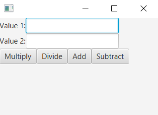

# eventHandling
```xml
<VBox id="AnchorPane" prefHeight="200" prefWidth="320" xmlns:fx="http://javafx.com/fxml/1" fx:controller="calculatorevent.FXMLDocumentController">
    <children>
        <GridPane>
            <Label text="Value 1:"  GridPane.rowIndex="0" GridPane.columnIndex="0"/>
            <Label text="Value 2:"  GridPane.rowIndex="1" GridPane.columnIndex="0"/>
            <TextField fx:id="txtVal1" GridPane.rowIndex="0" GridPane.columnIndex="1" />
            <TextField fx:id="txtVal2" GridPane.rowIndex="1" GridPane.columnIndex="1" />
        </GridPane>
        <HBox>
            <Button text="Multiply" fx:id="btnMultiply" onAction="#calculate"/>
            <Button text="Divide" fx:id="btnDivide"/>
            <Button text="Add" fx:id="btnAdd" onAction="#calculate"/>
            <Button text="Subtract" fx:id="btnSubtract" onAction="#calculate"/>
        </HBox>
        <Label fx:id="lblResult" text="" />
    </children>
</VBox>
```
```java
public class FXMLDocumentController implements Initializable {
    @FXML
    private TextField txtVal1, txtVal2;
    @FXML
    private Label lblResult;
    @FXML
    private Button btnMultiply, btnDivide, btnAdd, btnSubtract;
    
    // 첫번째 방법
    // action 별로 함수 만듦. 
    @FXML
    private void btnAdd(ActionEvent event){
        double n1 = Double.parseDouble(txtVal1.getText());
        double n2 = Double.parseDouble(txtVal2.getText());

        lblResult.setText(""+(n1 + n2));
    }

    // 두번째 방법
    // 함수 하나에서 id로 분기 함. 
    @FXML
    private void calculate(ActionEvent event) {
        double n1 = Double.parseDouble(txtVal1.getText());
        double n2 = Double.parseDouble(txtVal2.getText());

        if (event.getSource() == btnMultiply) {
            lblResult.setText("" + (n1 * n2));
        } else if (event.getSource() == btnSubtract) {
            lblResult.setText("" + (n1 - n2));
        }
    };
    
    // 세번째 방법
    // 익명함수로 만듦
    @Override
    public void initialize(URL url, ResourceBundle rb) {
        btnDivide.setOnAction(new EventHandler<ActionEvent>() {
            @Override
            public void handle(ActionEvent event) {
                double n1 = Double.parseDouble(txtVal1.getText());
                double n2 = Double.parseDouble(txtVal2.getText());
                lblResult.setText("" + (n1 / n2));
            }
        });
    }

}
```
