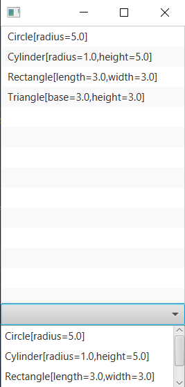

# list controls
```xml
<?xml version="1.0" encoding="UTF-8"?>

<?import java.lang.*?>
<?import java.util.*?>
<?import javafx.scene.*?>
<?import javafx.scene.control.*?>
<?import javafx.scene.layout.*?>

<BorderPane xmlns:fx="http://javafx.com/fxml/1" fx:controller="tmp.FXMLDocumentController">
    <center>
        <ListView fx:id ="lstShapes"/>
    </center>
    <bottom>
        <ComboBox fx:id="cmbShapes" editable="false" visibleRowCount="3" />
    </bottom>
</BorderPane>
```
```java

package tmp;

import alzghool.muath.ex.*;
import java.net.URL;
import java.util.ResourceBundle;
import javafx.collections.FXCollections;
import javafx.collections.ObservableList;
import javafx.fxml.FXML;
import javafx.fxml.Initializable;
import javafx.scene.control.ComboBox;
import javafx.scene.control.ListView;

public class FXMLDocumentController implements Initializable {
    
    @FXML
    private ListView<Shape> lstShapes;
    
    @FXML
    private ComboBox<Shape> cmbShapes;
    
    @Override
    public void initialize(URL url, ResourceBundle rb) {
        ObservableList<Shape> shape = FXCollections.observableArrayList();
        shape.add(new Circle(5));
        shape.add(new Cylinder(5));
        shape.add(new Rectangle(3, 3));
        shape.add(new Triangle(3, 3));
        
        lstShapes.setItems(shape);
        cmbShapes.setItems(shape);
    }    
   
}
```
