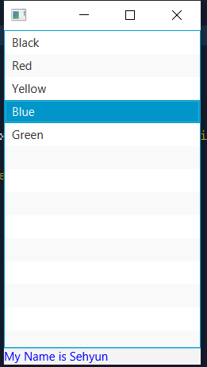

# Invalidation listener


```xml
<?xml version="1.0" encoding="UTF-8"?>

<?import java.lang.*?>
<?import java.util.*?>
<?import javafx.scene.*?>
<?import javafx.scene.control.*?>
<?import javafx.scene.layout.*?>

<VBox xmlns:fx="http://javafx.com/fxml/1" fx:controller="invalidationevent.FXMLDocumentController">
    <ListView  fx:id="lstColours" />
    <Label  fx:id="lblDisplay" text="My Name is Sehyun" />
</VBox>
```
```java
/*
 * To change this license header, choose License Headers in Project Properties.
 * To change this template file, choose Tools | Templates
 * and open the template in the editor.
 */
package invalidationevent;

import java.net.URL;
import java.util.ResourceBundle;
import javafx.beans.InvalidationListener;
import javafx.beans.Observable;
import javafx.collections.FXCollections;
import javafx.collections.ObservableList;
import javafx.fxml.FXML;
import javafx.fxml.Initializable;
import javafx.scene.control.Label;
import javafx.scene.control.ListView;
import javafx.scene.paint.Paint;

/**
 *
 * @author sehyu
 */
public class FXMLDocumentController implements Initializable {
    
    public enum Color {
        BLACK, RED, YELLOW, BLUE, GREEN
    }
    
    @FXML
    private Label lblDisplay;
    
    @FXML
    private ListView lstColours;
    
    private Color[] clours = {Color.BLACK, Color.RED, Color.YELLOW, Color.BLUE, Color.GREEN};
    private ObservableList<String> colourList = FXCollections.observableArrayList();
    
    @Override
    public void initialize(URL url, ResourceBundle rb) {
        colourList.addAll("Black", "Red", "Yellow", "Blue", "Green");
        lstColours.setItems(colourList);
        
        lstColours.getSelectionModel().selectedItemProperty().addListener(new InvalidationListener() {
            @Override
            public void invalidated(Observable observable) {
                int index = lstColours.getSelectionModel().getSelectedIndex();
                lblDisplay.setTextFill(Paint.valueOf("" + clours[index]));
            }
        });
    }
}
```

# ChangeListener
> Invalidation 이랑 똑같고 호출 함수 부분만 바뀜
```java
/*
 * To change this license header, choose License Headers in Project Properties.
 * To change this template file, choose Tools | Templates
 * and open the template in the editor.
 */
package invalidationevent;

import java.net.URL;
import java.util.ResourceBundle;
import javafx.beans.InvalidationListener;
import javafx.beans.Observable;
import javafx.beans.value.ChangeListener;
import javafx.beans.value.ObservableValue;
import javafx.collections.FXCollections;
import javafx.collections.ObservableList;
import javafx.fxml.FXML;
import javafx.fxml.Initializable;
import javafx.scene.control.Label;
import javafx.scene.control.ListView;
import javafx.scene.paint.Paint;

/**
 *
 * @author sehyu
 */
public class FXMLDocumentController implements Initializable {

    public enum Color {
        BLACK, RED, YELLOW, BLUE, GREEN
    }

    @FXML
    private Label lblDisplay;

    @FXML
    private ListView lstColours;

    private Color[] clours = {Color.BLACK, Color.RED, Color.YELLOW, Color.BLUE, Color.GREEN};
    private ObservableList<String> colourList = FXCollections.observableArrayList();

    @Override
    public void initialize(URL url, ResourceBundle rb) {
        colourList.addAll("Black", "Red", "Yellow", "Blue", "Green");
        lstColours.setItems(colourList);

        lstColours.getSelectionModel().selectedItemProperty().addListener(new ChangeListener() {
            @Override
            public void changed(ObservableValue observable, Object oldValue, Object newValue) {
                int index = lstColours.getSelectionModel().getSelectedIndex();
                lblDisplay.setTextFill(Paint.valueOf("" + clours[index]));
            }
        });
    }
}
```

