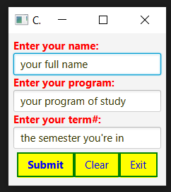

```xml
<?xml version="1.0" encoding="UTF-8"?>

<?import java.lang.*?>
<?import java.util.*?>
<?import javafx.scene.*?>
<?import javafx.scene.control.*?>
<?import javafx.scene.layout.*?>
<?import java.net.URL?>

<VBox id="vbox" xmlns:fx="http://javafx.com/fxml/1" fx:controller="cssexercise.FXMLDocumentController">
    <Label text="Enter your name: " />
    <TextField promptText = "your full name" fx:id="txtName" />
    <Label text="Enter your program: " />
    <TextField promptText = "your program of study" fx:id="txtPgm" />
    <Label text="Enter your term#: " />
    <TextField promptText = "the semester you're in" fx:id="txtTerm"/>
    <HBox id="hBox">
        <Button text="_Submit" styleClass="cssSubmit" fx:id="btnSumit" mnemonicParsing="true" defaultButton="true" />
        <Button text="_Clear" styleClass="cssClear" fx:id="btnClear" mnemonicParsing="true"/>
        <Button text="E_xit" styleClass="cssExit" fx:id="btnExit" mnemonicParsing="true"/>
    </HBox>
    <stylesheets>
        <URL value="@css/main.css" />
    </stylesheets>
</VBox>
```
```css
.root {
    -fx-padding: 7px;
}

.label {
    -fx-text-fill: red;
    -fx-font-weight: bold;
}

.button {
    -fx-text-fill: blue;
    -fx-background-color: yellow;
    -fx-border-width: 2px;
    -fx-border-color: green;
    -fx-border-style: solid;
}

.button:hover {
    -fx-text-fill: red;
    -fx-font-family: monospace;
    -fx-border-color: purple;
    -fx-border-style: dashed;
}

.cssSubmit{
    -fx-font-weight: bold;
}

.text-field {
    -fx-prompt-text-fill: #333300;
}

#hBox {
    -fx-padding: 5px;
}
```
