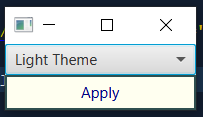

```xml
<?xml version="1.0" encoding="UTF-8"?>

<?import java.lang.*?>
<?import java.util.*?>
<?import javafx.scene.*?>
<?import javafx.scene.control.*?>
<?import javafx.scene.layout.*?>
<?import java.net.URL ?>

<BorderPane xmlns:fx="http://javafx.com/fxml/1" fx:controller="cssexercise2.FXMLDocumentController">
    <top>
        <ComboBox fx:id="ddlSettings" editable="false" />
    </top>
    <center>
        <Button text="_Apply" styleClass="light" fx:id="btnApply"
                 mnemonicParsing="true" maxWidth="Infinity" maxHeight="Infinity" /> 
    </center>
    <stylesheets>
        <URL value="@css/main.css" />
    </stylesheets>
</BorderPane>
```
```css
.button { -fx-border-width: 2px; }
.light { -fx-background-color: ivory; -fx-text-fill: navy; -fx-border-color: darkslategrey; }
.dark { -fx-background-color: slategrey; -fx-text-fill: white; 
        -fx-border-color: navy;
}
.high-contrast { -fx-background-color: black; -fx-text-fill: white;
                 -fx-border-color: black;
}
```
```java
package cssexercise2;

import java.net.URL;
import java.util.ResourceBundle;
import javafx.collections.FXCollections;
import javafx.collections.ObservableList;
import javafx.event.ActionEvent;
import javafx.event.EventHandler;
import javafx.fxml.FXML;
import javafx.fxml.Initializable;
import javafx.scene.control.Button;
import javafx.scene.control.ComboBox;

public class FXMLDocumentController implements Initializable {

    @FXML
    private Button btnApply;
    @FXML
    private ComboBox ddlSettings;
    private ObservableList<String> cssData = FXCollections.observableArrayList();
    private String[] cssNames = {"light", "dark", "high-contrast"};

    private int oldIndex = 0;

    @Override
    public void initialize(URL url, ResourceBundle rb) {
        cssData.addAll("Light Theme", "Dark Theme", "High Contrast Theme");
        ddlSettings.setItems(cssData);
        ddlSettings.getSelectionModel().select(0);
        ddlSettings.setOnAction(new EventHandler<ActionEvent>() {
            public void handle(ActionEvent event) {
                System.out.println(btnApply.getStyleClass());

                int index = ddlSettings.getSelectionModel().getSelectedIndex();
                btnApply.getStyleClass().remove(cssNames[oldIndex]);
                btnApply.getStyleClass().add(cssNames[index]);
                oldIndex = index;
            }
        });
    }

}
```
