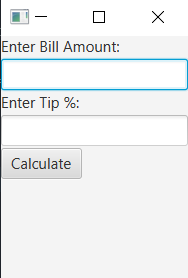

```xml
<?xml version="1.0" encoding="UTF-8"?>

<?import java.lang.*?>
<?import java.util.*?>
<?import javafx.scene.*?>
<?import javafx.scene.control.*?>
<?import javafx.scene.layout.*?>
<?import javafx.scene.text.Font ?>

<VBox spacing="2" xmlns:fx="http://javafx.com/fxml/1" fx:controller="tipcalculator.FXMLDocumentController">    
    <children>
        <Label text="Enter Bill Amount: " />
        <TextField id="txtBillAmt" fx:id="txtBillAmt" />
        
        <Label text="Enter Tip %: " />
        <TextField id="txtTipPercent" fx:id="txtTipPercent" />
        
        <Button text="Calculate" onAction="#calculateTip" fx:id="btnCalculate" />
        
        <Label fx:id="lblBill" minHeight="100.0">
            <font>
                <Font name="Courier New" size="14.0" />
            </font>
        </Label>
        
    </children>
</VBox>
```
```java
package tipcalculator;

import java.net.URL;
import java.util.ResourceBundle;
import javafx.event.ActionEvent;
import javafx.fxml.FXML;
import javafx.fxml.Initializable;
import javafx.scene.control.Label;
import javafx.scene.control.TextField;
import tipcalculator.model.Bill;

public class FXMLDocumentController implements Initializable {
    
    @FXML
    private TextField txtBillAmt, txtTipPercent;
    
    @FXML
    private Label lblBill;
    
    private Bill bill;
    
    @FXML
    public void calculateTip(ActionEvent event) {
        double billAmt = Double.parseDouble(txtBillAmt.getText());
        double tipPercent = Double.parseDouble(txtTipPercent.getText());
        
        bill = new Bill(billAmt, tipPercent);
        lblBill.setText(bill.toString());
    }
    
    @Override
    public void initialize(URL url, ResourceBundle rb) {
        // TODO
    }    
    
}
```
```java
package tipcalculator;

import javafx.application.Application;
import javafx.fxml.FXMLLoader;
import javafx.scene.Parent;
import javafx.scene.Scene;
import javafx.stage.Stage;

public class TipCalculator extends Application {
    
    @Override
    public void start(Stage stage) throws Exception {
        Parent root = FXMLLoader.load(getClass().getResource("FXMLDocument.fxml"));
        
        Scene scene = new Scene(root);
        stage.setTitle("Tip Calculator");
        stage.setScene(scene);
        stage.show();
    }

    public static void main(String[] args) {
        launch(args);
    }
    
}
```
```java
package tipcalculator.model;

public class Bill {
    public final double HST_RATE = .13;

    private double billAmt;         // amount on the bill
    private double tipPercent;      // the tip percentage

    public Bill(double amt) {
        setBillAmt(amt);
    }
    public Bill(double amt, double tip) {
        setBillAmt(amt);
        setTipPercent(tip);
    }
    public void setBillAmt(double amt) {
        if (amt >= 0) {
            billAmt = amt;
        } else {  // amount isn't valid
            throw new IllegalArgumentException("Error: Bill amount must be"
                + " 0 or more.");
        }
    }
    public double getBillAmt() {
        return billAmt;
    }
    public void setTipPercent(double tip) {
        if (tip >= 0) {
            tipPercent = tip;
        } else {  // tip percentage is invalid
            throw new IllegalArgumentException("Error: Tip percentage must be"
                + " 0 or more.");
        }
    }
    public double getTipPercent() {
        return tipPercent;
    }
    public double calcTip() {
        return tipPercent / 100 * billAmt;
    }
    public String toString() {
        // using tip twice, so calculate it once and store
        double tipAmt = calcTip();
        
        // build a formatted string for this bill
        return String.format("%-12s %6.2f%n%-12s %6.2f%n%-12s %6.2f%n",
            "Bill Amount:", billAmt, "Tip Amount:", tipAmt,
            "Total Due: ", billAmt + tipAmt);
    }
}
```


