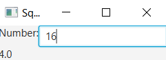

# Square Root Calculator
```xml
<?xml version="1.0" encoding="UTF-8"?>

<?import java.lang.*?>
<?import java.util.*?>
<?import javafx.scene.*?>
<?import javafx.scene.control.*?>
<?import javafx.scene.layout.*?>

<VBox xmlns:fx="http://javafx.com/fxml/1" fx:controller="squarerootcalculator.FXMLDocumentController">
    <HBox>
        <Label text="Number:" />
        <TextField fx:id="num"  onAction="#square" />
    </HBox>
        <Label fx:id="result" />
</VBox>
```
```java
package squarerootcalculator;

import java.net.URL;
import java.util.ResourceBundle;
import javafx.event.ActionEvent;
import javafx.event.EventHandler;
import javafx.fxml.FXML;
import javafx.fxml.Initializable;
import javafx.scene.control.Label;
import javafx.scene.control.TextField;

/**
 *
 * @author sehyu
 */
public class FXMLDocumentController implements Initializable {
    
    @FXML
    private Label result;
    
    @FXML
    private TextField num;
    
    @FXML
    private void square(ActionEvent event) {
        double n = Double.parseDouble(num.getText());
        result.setText(""+Math.sqrt(n));
    }
    
    @Override
    public void initialize(URL url, ResourceBundle rb) {
        // TODO
        num.setOnAction(new EventHandler<ActionEvent>() {
            @Override
            public void handle(ActionEvent event) {
                double n = Double.parseDouble(num.getText());
                result.setText(""+Math.sqrt(n));
                // square(event);
            }
        });
    }    
    
}
```

