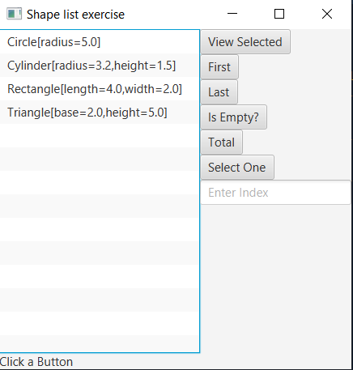

# List Shapes
```xml
<?xml version="1.0" encoding="UTF-8"?>

<?import java.lang.*?>
<?import java.util.*?>
<?import javafx.scene.*?>
<?import javafx.scene.control.*?>
<?import javafx.scene.layout.*?>

<BorderPane xmlns:fx="http://javafx.com/fxml/1" fx:controller="squarerootcalculator.FXMLDocumentController">
    <center>
        <ListView fx:id="lstShapes" />
    </center>
    <right>
        <VBox>
            <Button text="View Selected" fx:id="btnView" onAction="#display"/>
            <Button text="First" fx:id="btnFirst" onAction="#pick" />
            <Button text="Last" fx:id="btnLast" onAction="#pick" />
            <Button text="Is Empty?" fx:id="btnEmpty" onAction="#empty"/>
            <Button text="Total" fx:id="btnTotal" onAction="#total" />
            <Button text="Select One" fx:id="btnSelect" onAction="#pick" />
            <TextField promptText="Enter Index" fx:id="txt" />
        </VBox>
    </right>
    <bottom>
        <Label text="Click a Button" fx:id="lbl" />
    </bottom>
</BorderPane>
```
```java
package squarerootcalculator;

import alzghool.muath.ex.*;
import java.net.URL;
import java.util.ResourceBundle;
import javafx.collections.FXCollections;
import javafx.collections.ObservableList;
import javafx.event.ActionEvent;
import javafx.fxml.FXML;
import javafx.fxml.Initializable;
import javafx.scene.control.Button;
import javafx.scene.control.Label;
import javafx.scene.control.ListView;
import javafx.scene.control.MultipleSelectionModel;
import javafx.scene.control.TextField;

public class FXMLDocumentController implements Initializable {

    @FXML
    private ListView<Shape> lstShapes;

    @FXML
    private Button btnView, btnFirst, btnLast, btnEmpty, btnTotal, btnSelect;

    @FXML
    private TextField txt;

    @FXML
    private Label lbl;

    @FXML
    private void display(ActionEvent event) {
        lbl.setText("" + lstShapes.getSelectionModel().getSelectedIndex() + " : "
                + lstShapes.getSelectionModel().getSelectedItems());
    }

    @FXML
    private void pick(ActionEvent event) {

        MultipleSelectionModel<Shape> shape = lstShapes.getSelectionModel();
        if (event.getSource() == btnFirst) {
            shape.selectFirst();
            display(event);
        } else if (event.getSource() == btnLast) {
            shape.selectLast();
            display(event);
        } else if (event.getSource() == btnSelect) {
            int num = Integer.parseInt(txt.getText());
            if (num >= 0 && num < lstShapes.getItems().size()) {
                lstShapes.getSelectionModel().select(num);
                display(event);
            } else {
                lbl.setText("invalid index");
            }
        }
    }

    @FXML
    private void empty(ActionEvent event) {
        int index = lstShapes.getSelectionModel().getSelectedIndex();
        String result = "";
        if (index >= 0 && index < lstShapes.getItems().size()) {
            result = "Item Selected";
        } else {
            result = "No Item Selected";
        }
        lbl.setText(result);
    }

    @FXML
    private void total(ActionEvent event) {
        double sum = 0;
        for(int i=0; i < lstShapes.getItems().size(); i++){
            sum += lstShapes.getItems().get(i).getArea();
        }
        lbl.setText("Total : "+sum);
    }

    @Override
    public void initialize(URL url, ResourceBundle rb) {
        ObservableList<Shape> shape = FXCollections.observableArrayList();

        shape.add(new Circle(5));
        shape.add(new Cylinder(1.5, 3.2));
        shape.add(new Rectangle(4, 2));
        shape.add(new Triangle(2, 5));

        lstShapes.setItems(shape);
    }
}
```

