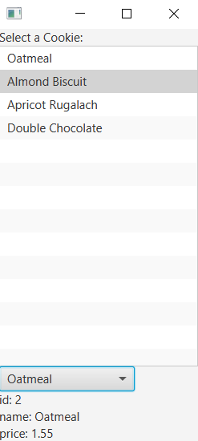

```xml
<?xml version="1.0" encoding="UTF-8"?>

<?import java.lang.*?>
<?import java.util.*?>
<?import javafx.scene.*?>
<?import javafx.scene.control.*?>
<?import javafx.scene.layout.*?>

<VBox xmlns:fx="http://javafx.com/fxml/1" fx:controller="cookies.FXMLDocumentController">
    <Label text="Select a Cookie:" />
    <ListView fx:id="list"/>
    <ComboBox fx:id="cmb" editable="false" visibleRowCount="3" onAction="#selectedCmb"/>
    <Label text="cookie id" fx:id="cmbcookieid" /> 
    <Label text="cookie name" fx:id="cmbcookiename" />
    <Label text="cookie price" fx:id="cmbcookieprice" />
</VBox>
```
```java
package cookies;

import java.net.URL;
import java.util.ResourceBundle;
import javafx.beans.value.ChangeListener;
import javafx.beans.value.ObservableValue;
import javafx.collections.FXCollections;
import javafx.collections.ObservableList;
import javafx.event.ActionEvent;
import javafx.event.EventHandler;
import javafx.fxml.FXML;
import javafx.fxml.Initializable;
import javafx.scene.control.ComboBox;
import javafx.scene.control.Label;
import javafx.scene.control.ListView;
import prog24178.labs.objects.Cookies;

public class FXMLDocumentController implements Initializable {

    @FXML
    private Label cmbcookieid, cmbcookiename, cmbcookieprice;

    @FXML
    private ComboBox<Cookies> cmb;

    @FXML
    private ListView<Cookies> list;

    @FXML
    private void display(ActionEvent event) {
        Cookies ck = cmb.getSelectionModel().getSelectedItem();
        cmbcookieid.setText("id: " + ck.getId());
        cmbcookiename.setText("name: " + ck.getName());
        cmbcookieprice.setText("price: " + ck.getPrice());

    }

    @Override
    public void initialize(URL url, ResourceBundle rb) {
        ObservableList<Cookies> ck = FXCollections.observableArrayList();
        ck.add(Cookies.OATMEAL);
        ck.add(Cookies.ALMOND_BISCUIT);
        ck.add(Cookies.APRICOT_RUGALACH);
        ck.add(Cookies.DOUBLE_CHOCOLATE);

        cmb.setItems(ck);
        list.setItems(ck);

        cmb.getSelectionModel().select(1);
        list.getSelectionModel().select(1);

        list.getSelectionModel().selectedItemProperty().addListener(new ChangeListener() {
            @Override
            public void changed(ObservableValue observable, Object oldValue, Object newValue) {
                Cookies ck = list.getSelectionModel().getSelectedItem();
                cmbcookieid.setText("id: " + ck.getId());
                cmbcookiename.setText("name: " + ck.getName());
                cmbcookieprice.setText("price: " + ck.getPrice());
            }

        });
    }

}
```
