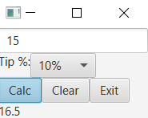

```xml
<?xml version="1.0" encoding="UTF-8"?>

<?import java.lang.*?>
<?import java.util.*?>
<?import javafx.scene.*?>
<?import javafx.scene.control.*?>
<?import javafx.scene.layout.*?>

<VBox xmlns:fx="http://javafx.com/fxml/1" fx:controller="updatedtipcalculator.FXMLDocumentController">
    <TextField fx:id="bAmt" promptText="Bill Amount" />
    <HBox>
        <Label text="Tip %:" />
        <ComboBox fx:id="cmb" editable="false" visibleRowCount="3" />
    </HBox>
    <HBox>
        <Button text="_Calc" fx:id="calc" mnemonicParsing="true" defaultButton="true" onAction="#calc" />
        <Button text="_Clear" fx:id="clear" mnemonicParsing="true" cancelButton="true" onAction="#clear" />
        <Button text="_Exit" fx:id="exit" mnemonicParsing="true" onAction="#exit" />
    </HBox>
    <Label fx:id="result" />
</VBox>
```
```java
/*
 * To change this license header, choose License Headers in Project Properties.
 * To change this template file, choose Tools | Templates
 * and open the template in the editor.
 */
package updatedtipcalculator;

import java.net.URL;
import java.util.ResourceBundle;
import javafx.collections.FXCollections;
import javafx.collections.ObservableList;
import javafx.event.ActionEvent;
import javafx.fxml.FXML;
import javafx.fxml.Initializable;
import javafx.scene.control.Button;
import javafx.scene.control.ComboBox;
import javafx.scene.control.Label;
import javafx.scene.control.TextField;
import javafx.stage.Stage;

/**
 *
 * @author sehyu
 */
public class FXMLDocumentController implements Initializable {

    @FXML
    private TextField bAmt;

    @FXML
    private Label result;

    @FXML
    private Button exit;

    @FXML
    private ComboBox<String> cmb;

    @FXML
    private void calc(ActionEvent event) {
        String percent = cmb.getSelectionModel().getSelectedItem();
        double pDouble = Double.parseDouble(percent.substring(0, percent.length() - 1));
        double bAmount = Double.parseDouble(bAmt.getText());
        double calculated = bAmount + bAmount * pDouble / 100;
        result.setText("" + calculated);
    }

    @FXML
    private void clear(ActionEvent event) {
        result.setText("");
    }

    @FXML
    private void exit(ActionEvent event) {
        Stage stage = (Stage) exit.getScene().getWindow();
        stage.close();
    }

    @Override
    public void initialize(URL url, ResourceBundle rb) {
        String[] strPercent = {"0%", "5%", "10%", "15%", "20%", "25%"};
        ObservableList<String> oList = FXCollections.observableArrayList(strPercent);
        cmb.setItems(oList);

        cmb.getSelectionModel().select(3);
    }

}
```
