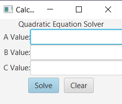
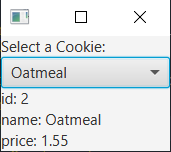
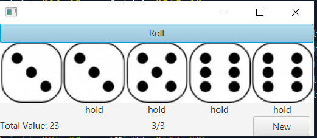

# 1.TipCalculator

# 2.SquareRootCalculator

# 3.QuadraticCalculator

# 4.ListShapes

# 5.cookieCombo

# 6.cookieList

# 7.updatedTipCalculator

# 8.ConversionOperator

# 9.SmileImage

# 10.Dice

# 11.javaFxStyle

