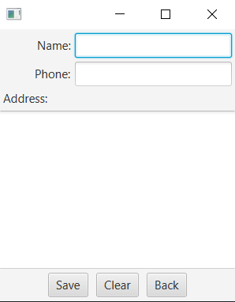

# Nested

```xml
<BorderPane xmlns:fx="http://javafx.com/fxml/1"
    fx:controller="prog24178.fx.FXMLDocumentController">
    <fx:define>
        <Insets fx:id="nodeMargins" top="5" right="5" bottom="5" left="5" />
    </fx:define>
    <top>
        <GridPane vgap="5" hgap="5" BorderPane.margin="$nodeMargins">
            <columnConstraints>
                <ColumnConstraints percentWidth="50.0" />
                <ColumnConstraints percentWidth="50.0" />
            </columnConstraints>      
            <children>
                <Button maxWidth="Infinity" text="Five" GridPane.rowIndex="0" GridPane.columnIndex="0"/>
                <Button maxWidth="Infinity" text="1" GridPane.rowIndex="0" GridPane.columnIndex="1"/>
            </children>
        </GridPane>
    </top>
    <center>
        <Button maxHeight="Infinity" maxWidth="Infinity" text="Seven"
             BorderPane.margin="$nodeMargins" />
    </center>
    <right>
        <VBox spacing="10" alignment="CENTER" BorderPane.margin="$nodeMargins">
            <children>
                <Button text="Two" maxWidth="Infinity" />
                <Button text="Three" maxWidth="Infinity" />
                <Button text="Four" maxWidth="Infinity" />
            </children>
        </VBox>
    </right>
 
</BorderPane>
```


# Exercise
```xml
<BorderPane xmlns:fx="http://javafx.com/fxml/1" fx:controller="exercise.FXMLDocumentController">
    <fx:define> 
        <Insets fx:id="nodeMargins" top="5" right="5" bottom="5" left="5" />
    </fx:define>
    <top>
        <GridPane vgap="5" hgap="5" BorderPane.margin="$nodeMargins">
            <columnConstraints>
                <ColumnConstraints percentWidth="30.0" />
                <ColumnConstraints percentWidth="70.0" />
            </columnConstraints>      
            <children>
                <Label text="Name:" GridPane.halignment="RIGHT" GridPane.rowIndex="0" GridPane.columnIndex="0">
<!--                    <GridPane.margin>
                        <Insets right="15"/>
                    </GridPane.margin>-->
                </Label>
                <!--<TextField GridPane.rowIndex="0" GridPane.columnIndex="1" GridPane.columnSpan="3"/>--> 
                <TextField GridPane.rowIndex="0" GridPane.columnIndex="1" /> 
                
                <Label text="Phone:" GridPane.halignment="RIGHT" GridPane.rowIndex="1" GridPane.columnIndex="0"/>
                <TextField GridPane.rowIndex="1" GridPane.columnIndex="1"/>
                <Label text="Address:" GridPane.halignment="LEFT" GridPane.rowIndex="2" GridPane.columnIndex="0"/>
            </children>
        </GridPane>
    </top>
    <center>
        <TextArea prefHeight="200.0" prefWidth="300.0" wrapText="true" />
    </center>
    <bottom>
        <HBox spacing="10" alignment="CENTER" BorderPane.margin="$nodeMargins">
            <children>
                <Button text="Save" />
                <Button text="Clear" />
                <Button text="Back" />
            </children>
        </HBox>
    </bottom> 
</BorderPane>
```
